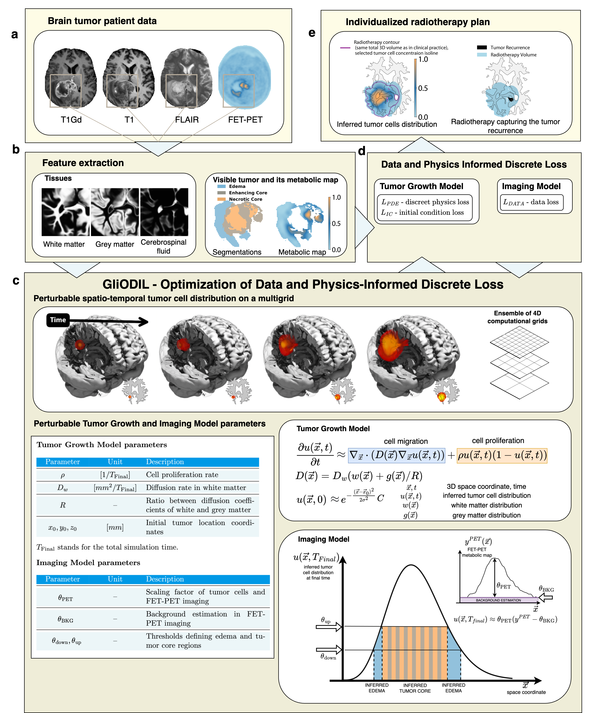

# Glioma Radiotherapy Design by Optimization of a Data and Physics-Informed Discrete Loss (GliODIL)

## Introduction

This repository contains the implementation of the GliODIL framework, as introduced in our paper "Glioma Radiotherapy Design by Optimization of a Data and Physics Informed Discrete Loss." \[1\] GliODIL is an innovative optimization framework for inferring estimates of tumor cell concentrations and migration pathways in gliomas, using data from MRI and PET scans.

Our approach integrates traditional numerical methods with data-driven paradigms, offering a comprehensive understanding of tumor behavior. GliODIL builds upon  the Optimizing a Discrete Loss (ODIL) technique \[2,3\] (GitHub: https://github.com/cselab/odil),  enabling PDE-constrained optimization with multigrid methods.


 
**GliODIL Overview:**
- **a. Multi-modal patient data:** This includes MRI and PET imaging to provide comprehensive information about the tumor.
- **b. Features extraction:** Tissue extraction using an atlas registration. Automated segmentation of tumor regions is performed. The areas identified include:
  - **Edema:** Characterized by tissue swelling due to fluid accumulation.
  - **Enhancing core:** Indicative of active tumor growth, characterized by altered vascular properties.
  - **Necrotic core:** Shows tissue death due to hypoxia or nutrient deprivation.
  - Corresponding PET scans provide metabolic insight, further aiding in accurate tumor delineation.
- **c. Calculation of discrepancy and tumor physics residual:** This involves the calculation of discrepancy between the patient's tumor characteristics \(denoted as $L_{\text{DATA}}$ \) and the tumor cell distribution proposed by GliODIL at the final timestep. Also, the calculation of the tumor physics residual \(denoted as $L_{\text{PDE}}$ \) and a single focal initial condition \(denoted as $L_{\text{IC}}$ \).
- **d. Spatio-temporal progression of a tumor:** The progression is observed within the patient's anatomy. Values are stored on a multi-resolution grid, where each level is coarser than the previous one. The table includes Tumor Growth and Imaging Model parameters. The optimization process utilizes automatic differentiation and is guided by the loss function. 
- **e. GliODIL outputs.** The framework infers the complete distribution of tumor cells, facilitating the development of a radiotherapy plan. This plan effectively covers areas of tumor recurrence identified in post-operative data, while maintaining the total radiotherapy volume in line with standard clinical guidelines.}
## Requirements

To run the GliODIL framework, ensure the following dependencies are installed:

### Python Packages
- tensorflow
- matplotlib
- scipy
- numpy
- pyamg
- nibabel
- six

### Debian Packages
- libmpich-dev
- rsync

### Hardware
Takes around 30-45 minutes on a single GPU (needs > 18.5 GBs of memory). Can run on CPUs if necessary.

## Usage

### Running GliODIL

Use the provided bash script `run_GliODIL.sh` with a directory containing the necessary .nii or .nii.gz files.

```bash
./run_GliODIL.sh <directory>
```
The script searches for files in the specified directory with the extensions .nii or .nii.gz, including segmentation files, white matter, grey matter, and optional PET scan files. The naming convention for these files should be `*_segm_*`, `*_wm_*`, `*_gm_*`, and `*_pet_*` for segmentations, WM, GM, and PET files, respectively. Segmentations should follow the BraTS toolkit segmentation convention \[4], with voxel values representing different tumor regions: 1.0 for enhancing core, 3.0 for edema, and 4.0 for necrotic core. The command creates a subdirectory with results in a given directory.  If you do not have brain tissues segmentation, you can use the [s3 tool](https://github.com/JanaLipkova/s3) \[5\].


### Generating Synthetic Patients

Generate synthetic patients with tumors using the following commands:

For a single focal tumor:
```bash
python run_synthetic_generator1T.py --N 1
```
Creates a patient in `synthetic_runs1T/synthetic1Trun0`.

For three focal tumors:
```bash
python run_synthetic_generator3T.py --N 1
```
Creates a patient in `synthetic_runs3T/synthetic3Trun0`.

The seeds are fixed to enable recreation of the paper's synthetic dataset. 

### Real Patients
Link to download patient data used in the study [Link](https://huggingface.co/datasets/m1balcerak/GliODIL)

## Recurrence
We provide the recurrence % numbers for studied patients in figures/SourceData.txt

## Contribution

Suggestions are welcome. 

## Cite
In publications using GliODIL or data released with this framework please consider citing:
1. Balcerak, M., Weidner, J., Karnakov, P., Ezhov, I., Litvinov, S., Koumoutsakos, P., Zhang, R. Z., Lowengrub, J. S., Wiestler, B., & Menze, B. (2024). Individualizing Glioma Radiotherapy Planning by Optimization of Data and Physics-Informed Discrete Loss. arXiv preprint arXiv:2312.05063
   
2. Karnakov, P., Litvinov, S., & Koumoutsakos, P. (2022). Optimizing a discrete loss (ODIL) to solve forward and inverse problems for partial differential equations using machine learning tools. arXiv preprint arXiv:2205.04611
3. Karnakov, P., Litvinov, S., & Koumoutsakos, P. (2023). Flow reconstruction by multiresolution optimization of a discrete loss with automatic differentiation. The European Physical Journal E, 46(7), 59
## Other references
4. Kofler, F., Berger, C., Waldmannstetter, D., Lipkova, J., Ezhov, I., Tetteh, G., Kirschke, J., Zimmer, C., Wiestler, B., & Menze, B. H. (2020). BraTS toolkit: translating BraTS brain tumor segmentation algorithms into clinical and scientific practice. Frontiers in neuroscience, 125
5. Lipkova et al., Personalized Radiotherapy Design for Glioblastoma: Integrating Mathematical Tumor Models, Multimodal Scans and Bayesian Inference., IEEE Transaction on Medical Imaging, (2019)
